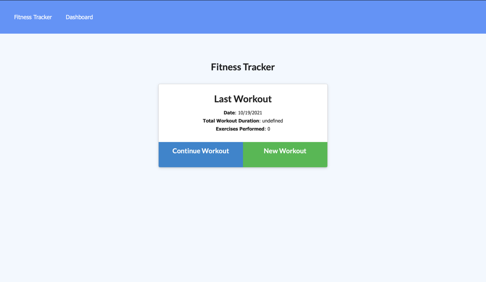
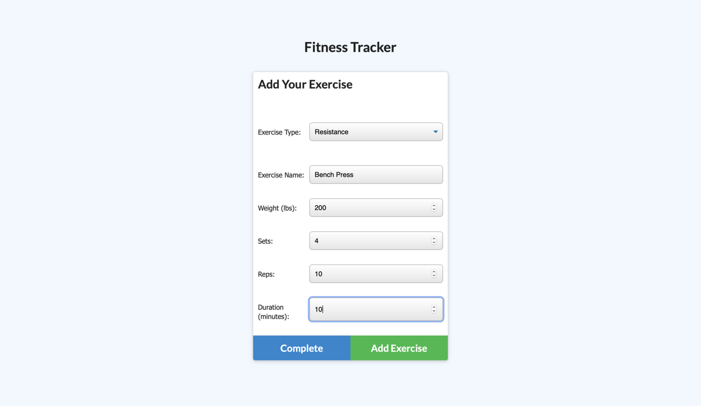

# NoSQL: Workout Tracker

It is a react base application which is use to keep track the exercise. User can upload the name, type, weight, sets, reps, and duration of workout which will be able to view, create, and track their daily workouts. It is created with Mongo database including Mongoose schema and handle routes with Express. This app will help the user to reach their fitness goals more quickly when they track their workout results.


## Deployed Heroku Link:
 ### [Workout-Tracker!](https://blooming-anchorage-64819.herokuapp.com)

## Key Features

When the user loads the page, they will be provided with the option to create a new workout or continue with their last workout.
```
The user should be able to:

  1. Add exercises to the most recent workout plan.

  2. Add new exercises to a new workout plan.

  3.  View the combined weight of multiple exercises from the past seven workouts on the `stats` page.

  4.  View the total duration of each workout from the past seven workouts on the `stats` page.
 
 ```

## Screenshots:
  ### Home page
  

 ### Dashboard page
  

 ### Workout selector page
  

 ### Cardio's workout page
  

 ### Resistance's workout page
  


## Technologies 
[MongoDB on the $addFields](https://docs.mongodb.com/manual/reference/operator/aggregation/addFields/)

[MongoDB on the $sum operator](https://docs.mongodb.com/manual/reference/operator/aggregation/sum/)

[Mongoose on aggregate functions](https://mongoosejs.com/docs/api.html#aggregate_Aggregate)


## Links :
* Link for the deployed application on heroku [Workout-Tracker!](https://blooming-anchorage-64819.herokuapp.com)
* Link for the Github repository [Host by Github](https://github.com/Rajesh295-dev/Workout-Tracker)
## Contributor:

* [Rajesh Gautam](https://github.com/Rajesh295-dev)
---
